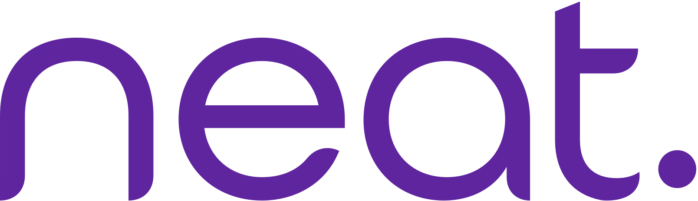

# Neat Pulse - Bulk Room Creation

<!-- Back to top link. -->

<!-- PROJECT SHIELDS -->
<!--
*** I'm using markdown "reference style" links for readability.
*** Reference links are enclosed in brackets [ ] instead of parentheses ( ).
*** See the bottom of this document for the declaration of the reference variables
*** for contributors-url, forks-url, etc. This is an optional, concise syntax you may use.
*** https://www.markdownguide.org/basic-syntax/#reference-style-links
-->
[![Contributors][contributors-shield]][contributors-url]
[![Forks][forks-shield]][forks-url]
[![Stargazers][stars-shield]][stars-url]
[![Issues][issues-shield]][issues-url]
[![Unlicense License][license-shield]][license-url]
[![LinkedIn][linkedin-shield]][linkedin-url]

<!-- PROJECT LOGO -->
 

  

  <h3 align="center">Neat Pulse :: Bulk Room Creation Tool</h3>

  

    An awesome tool to bulk create rooms in <a href="https://neat.no/pulse">Neat Pulse</a>
     
    <a href="https://neatpulseroomcreate.replit.app/"><strong>Go to the tool!</strong></a>
     
     
    <a href="https://github.com/othneildrew/Best-README-Template">View Demo</a>
    &middot;
    <a href="https://github.com/rougenbacher/Neat-Pulse---Bulk-Room-Create/issues/new?labels=bug&template=bug-report.md">Report Bug</a>
    &middot;
    <a href="https://github.com/rougenbacher/Neat-Pulse---Bulk-Room-Create/issues/new?labels=enhancement&template=feature-request.md">Request Feature</a>
  

<!-- TABLE OF CONTENTS -->

  
Table of Contents

  <ol>
    <li>
      <a href="#about-the-project">About The Project</a>
      <ul>
        <li><a href="#built-with">Built With</a></li>
      </ul>
    </li>
    <li>
      <a href="#getting-started">Getting Started</a>
      <ul>
        <li><a href="#prerequisites">Prerequisites</a></li>
        <li><a href="#installation">Installation</a></li>
      </ul>
    </li>
    <li><a href="#usage">Usage</a></li>
    <li><a href="#roadmap">Roadmap</a></li>
    <li><a href="#contributing">Contributing</a></li>
    <li><a href="#license">License</a></li>
    <li><a href="#contact">Contact</a></li>
    <li><a href="#acknowledgments">Acknowledgments</a></li>
  </ol>

<!-- ABOUT THE PROJECT -->
## About The Project

[![Product Name Screen Shot][product-screenshot]](https://example.com)

Managing large-scale deployments of Neat devices should be seamless and efficient. This online tool was developed to simplify the process of bulk room creation in Neat Pulse, allowing Neat customers to upload a CSV file and generate multiple rooms at once. By leveraging available APIs, the tool streamlines room provisioning, reducing the time and effort required for large deployments—all through a simple, user-friendly interface.

Here’s Why

<ul>
  <li><b>Simplifies Bulk Room Creation</b> - Eliminates the 20-room manual creation limit by enabling CSV uploads.</li>
  <li><b>No API Knowledge Required</b> - Many enterprise customers lack the expertise to use APIs directly, so this tool provides an intuitive interface.</li>
  <li><b>Faster Deployments</b> - Reduces the time and effort needed for setting up large-scale Neat Pulse environments.</li>
  <li><b>Enrollment Codes in CSV Format</b> - Generates enrollment codes in the same CSV format used for room creation, making it easy to distribute and track.</li>
 
Read on to get started! 

(<a href="#readme-top">back to top</a>)

### Built With

This project was built on replit using the following. 

* [![Next][Next.js]][Next-url]

(<a href="#readme-top">back to top</a>)

<!-- GETTING STARTED -->
## Getting Started

Follw the below steps to get started bulk enrolling devices into Neat Pulse. 

### Prerequisites

You will need the following in order to use this tool:
<ul>
  <li>An active Neat Pulse account.</li>
  <li>Pulse Plus or Pro licenses for all devices to enable API access</li>
  <li>An API Key with Read abd Write Access</li>
  <li>Your Organization ID</li>
  <li>Region(s) and location(s) created in your Pulse tenant.</li>
  <li>List of room names that you would like to create.</li>
</ul>

<!-- USAGE EXAMPLES -->
## Usage
<ol>
  <li><strong>Set Up Locations</strong>
    <ul>
      <li>Create necessary Regions/Locations in Neat Pulse. Rooms without a location will be assigned to "Unassigned" and must be updated manually.</li>
    </ul>
  </li>
  <li><strong>Get Org ID and API Key</strong>
    <ul>
      <li>In your Pulse tenat, navigate to the *Settings* tab on the left. From there copy the *Organization ID*.</li>
      <li>While still in *Settings*, click *Create API Key*. Give a descriptive name and ensure you select both *Read* and *Write* for the scope.</li>
    </ul>
  </li>
  <li><strong>Set Organization ID and API Key</strong>
    <ul>
      <li>Navigate to the <a href="https://neatpulseroomcreate.replit.app/">Bulk Room Creation Tool</a></li>
      <li>Enter your API Key and press *Set API Key*</li>
      <li>Enter your Organization ID and press *Set Org ID*</li>
    </ul>
  </li>
  <li><strong>Get Location IDs</strong>
    <ul>
      <li>Press the *Get Locations* button to get location IDs. Make sure to note these as they'll be needed in the next step.</li>
    </ul>
  </li>
  <li><strong>Download and Fill Out CSV</strong>
    <ul>
      <li>Click *Downlad CSV Template* to download a pre-populated CSV.</li>
      <li>Fill out CSV with Room Names and Location ID gathered in the previous step. Leave the *enrollment_code* column empty.</li>
    </ul>
  </li>
  <li><strong>Create Rooms</strong>
    <ul>
      <li>Click *Choose file* to select you populated CSV. Note: Rooms without a location will be assigned to "Unassigned" and must be updated manually.</li>
      <li>Click *Create Rooms*. This will create new rooms in thr appropriate locations. Once completed you will see the status of each room along with its enrollment code.  You can write these down or just click *Download CSV* to get an updated CSV populated with enrollment codes.</li>
    </ul>
  </li>
  <li><strong>Delete API Key</strong>
    <ul>
      <li>As this API key wont be used for a continuing integration, it is best practice to delete your API Key in Neat Pulse. Do this by going to *Settings > API Keys* and clicking the pencil at the right of the API key being used and click *Delete API Key* from the pop-up dialog box.</li>
    </ul>
  </li>
</ol>

(<a href="#readme-top">back to top</a>)

<!-- ROADMAP -->
## Roadmap

- [ ] Add standalone Zoom Room creation
- [ ] Add ability to create Pulse Rooms and Zoom Rooms with one CSV
- [ ] Add standalone Teams Room creation (pending MSFT limitstions)
- [ ] Add ability to create Pulse Rooms and Teams Rooms with one CSV

See the [open issues](https://github.com/rougenbacher/Neat-Pulse---Bulk-Room-Create/issues) for a full list of proposed features (and known issues).

(<a href="#readme-top">back to top</a>)

<!-- CONTACT -->
## Contact

Chris Rouge - [LinkedIn](http://linkedin.com/in/chrisrouge) - rougechris@protonmail.com

Project Link: [https://github.com/your_username/repo_name](https://github.com/your_username/repo_name)

(<a href="#readme-top">back to top</a>)

<!-- ACKNOWLEDGMENTS -->
## Acknowledgments

Use this space to list resources you find helpful and would like to give credit to. I've included a few of my favorites to kick things off!

* [Choose an Open Source License](https://choosealicense.com)
* [GitHub Emoji Cheat Sheet](https://www.webpagefx.com/tools/emoji-cheat-sheet)
* [Malven's Flexbox Cheatsheet](https://flexbox.malven.co/)
* [Malven's Grid Cheatsheet](https://grid.malven.co/)
* [Img Shields](https://shields.io)
* [GitHub Pages](https://pages.github.com)
* [Font Awesome](https://fontawesome.com)
* [React Icons](https://react-icons.github.io/react-icons/search)

(<a href="#readme-top">back to top</a>)

<!-- MARKDOWN LINKS & IMAGES -->
<!-- https://www.markdownguide.org/basic-syntax/#reference-style-links -->
[contributors-shield]: https://img.shields.io/github/contributors/othneildrew/Best-README-Template.svg?style=for-the-badge
[contributors-url]: https://github.com/othneildrew/Best-README-Template/graphs/contributors
[forks-shield]: https://img.shields.io/github/forks/othneildrew/Best-README-Template.svg?style=for-the-badge
[forks-url]: https://github.com/othneildrew/Best-README-Template/network/members
[stars-shield]: https://img.shields.io/github/stars/othneildrew/Best-README-Template.svg?style=for-the-badge
[stars-url]: https://github.com/othneildrew/Best-README-Template/stargazers
[issues-shield]: https://img.shields.io/github/issues/othneildrew/Best-README-Template.svg?style=for-the-badge
[issues-url]: https://github.com/othneildrew/Best-README-Template/issues
[license-shield]: https://img.shields.io/github/license/othneildrew/Best-README-Template.svg?style=for-the-badge
[license-url]: https://github.com/othneildrew/Best-README-Template/blob/master/LICENSE.txt
[linkedin-shield]: https://img.shields.io/badge/-LinkedIn-black.svg?style=for-the-badge&logo=linkedin&colorB=555
[linkedin-url]: https://linkedin.com/in/chrisrouge
[product-screenshot]: images/screenshot.png
[Next.js]: https://img.shields.io/badge/next.js-000000?style=for-the-badge&logo=nextdotjs&logoColor=white
[Next-url]: https://nextjs.org/
[React.js]: https://img.shields.io/badge/React-20232A?style=for-the-badge&logo=react&logoColor=61DAFB
[React-url]: https://reactjs.org/
[Vue.js]: https://img.shields.io/badge/Vue.js-35495E?style=for-the-badge&logo=vuedotjs&logoColor=4FC08D
[Vue-url]: https://vuejs.org/
[Angular.io]: https://img.shields.io/badge/Angular-DD0031?style=for-the-badge&logo=angular&logoColor=white
[Angular-url]: https://angular.io/
[Svelte.dev]: https://img.shields.io/badge/Svelte-4A4A55?style=for-the-badge&logo=svelte&logoColor=FF3E00
[Svelte-url]: https://svelte.dev/
[Laravel.com]: https://img.shields.io/badge/Laravel-FF2D20?style=for-the-badge&logo=laravel&logoColor=white
[Laravel-url]: https://laravel.com
[Bootstrap.com]: https://img.shields.io/badge/Bootstrap-563D7C?style=for-the-badge&logo=bootstrap&logoColor=white
[Bootstrap-url]: https://getbootstrap.com
[JQuery.com]: https://img.shields.io/badge/jQuery-0769AD?style=for-the-badge&logo=jquery&logoColor=white
[JQuery-url]: https://jquery.com 
